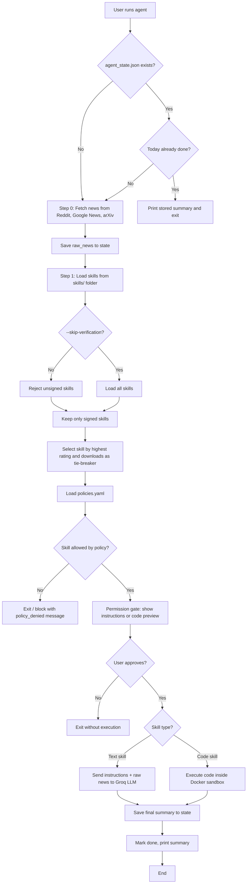

# Architecture Overview

This document explains the high‑level architecture of the Agentic Threat Hunter – a stateful AI news agent with a simulated skill marketplace and multiple security layers.

## System Flowchart

The following diagram shows the agent’s main execution loop, including state management, skill selection, policy enforcement, and sandboxed execution.



## Component Descriptions

| Component | File | Purpose |
|-----------|------|---------|
| **Agent core** | `agent.py` | State machine, news fetching, skill loading, selection logic, policy enforcement, execution dispatcher. |
| **Skill marketplace** | `skills/*.json` | Local JSON files that define skills (name, description, rating, downloads, and either `instructions` for text or `code` for Python). |
| **Integrity verification** | `sign_skill.py`, `sign_all_skills.py` | HMAC‑SHA256 signing and verification. Rejects tampered or unauthorised skill files. |
| **Policy as code** | `policies.yaml` | Declarative rules: allowed skills, approval requirements, sandbox limits, default behaviour. |
| **Sandbox** | `sandbox_docker.py`, `Dockerfile` | Docker container with read‑only filesystem, no network, non‑root user, CPU/memory limits. Isolates code skills. |
| **Observability** | `logger.py`, `logs/` | Structured JSONL audit logs and SQLite metrics (tokens, steps, errors, duration). |
| **Dashboard** | `ui.py` | Streamlit front‑end to run the agent, inspect state, view logs, edit policies, and monitor metrics. |

## State Management

The agent is **resumable** – all progress is saved to `agent_state.json`.  
Fields stored:

```json
{
  "date": "2026-05-21",
  "step": 0|1|2|3,
  "raw_news": [...],
  "chosen_skill_name": "...",
  "final_summary": "...",
  "done": true/false
}
```

If `done` is `true` for the current day, the agent prints the cached summary without re‑fetching or re‑executing.

## Security Layers (Defence in Depth)

1. **Signature verification** – prevents unauthorised skill file changes.  
2. **Policy‑as‑code** – centralised control over which skills are allowed.  
3. **Permission gate** – human approval before any skill execution.  
4. **Docker sandbox** – isolates code skills; blocks network, file writes, and root operations.  
5. **Audit logs** – complete, tamper‑evident record of every action.  

## Trade‑offs & Limitations

- **Selection logic** is deliberately popularity‑based (highest rating) to demonstrate the attack. Real systems use hybrid (RAG + LLM) or user‑pinned skills.  
- **HMAC signing** uses a shared secret; production would use asymmetric keys (Ed25519).  
- **Sandbox** relies on Docker; a compromised Docker daemon could still break isolation (mitigated by `read_only`, `no-new-privileges`, etc.).  
- **Policy enforcement** still depends on human review – fine for demos, but future work could add automated risk scoring.

## Extensibility Points

- Replace rating‑based selection with a vector‑RAG + LLM router.  
- Replace HMAC with Ed25519 signing.  
- Add OpenTelemetry tracing for distributed observability.  
- Convert local skill folder into a remote registry with authentication.

---

For a step‑by‑step demo with screenshots, see [demo.md](demo.md).  
For setup and usage, see the main [README](../README.md).
```
- `tie‑breaker` (with special hyphen) → `tie-breaker` (standard ASCII hyphen).

Now the Mermaid diagram will render correctly on GitHub. After updating `docs/architecture.md`, commit and push.
