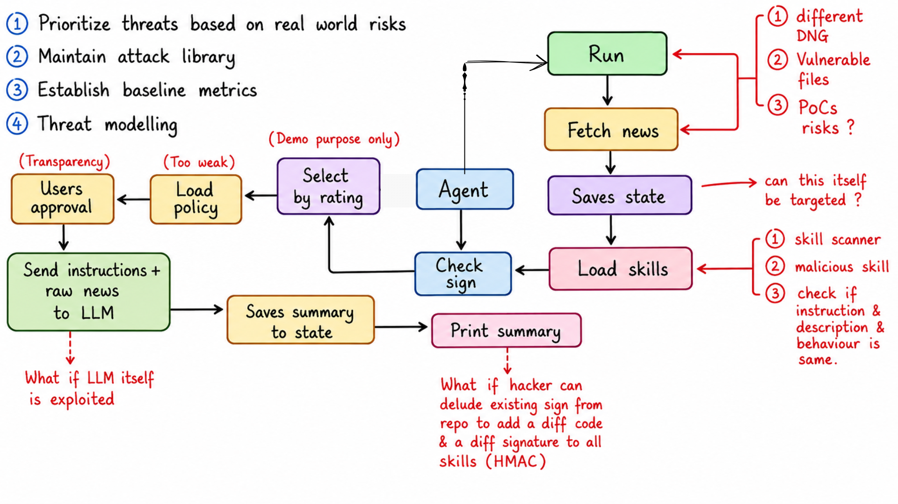
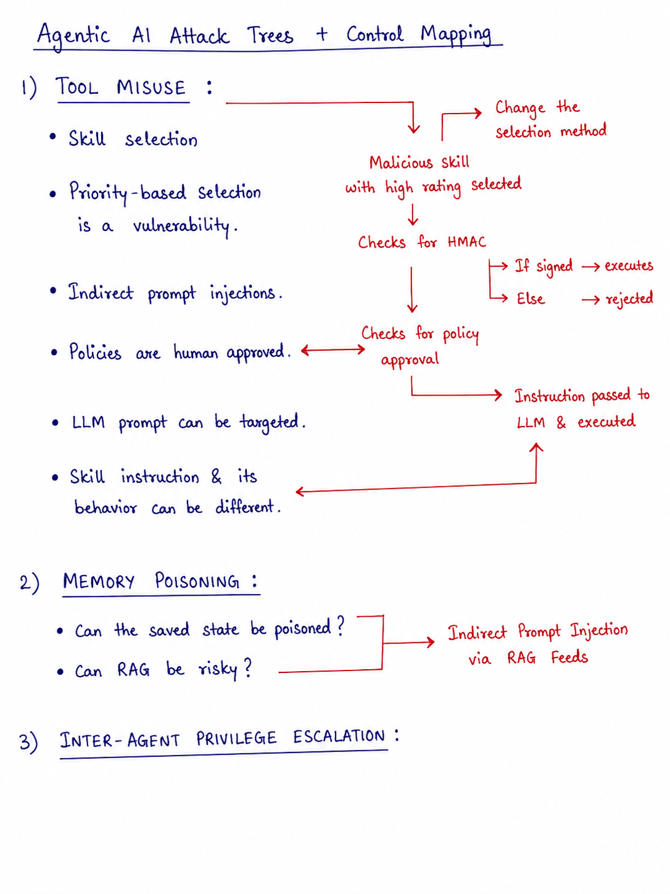

# Threat Modelling Process Using MAESTRO Framework

**Related Files:**  

- Attack simulation script: `../02-attack-simulation/simulate_key_compromise.py`
- Keyring mitigation: `../03-mitigations/keyring-implementation.md`

---

## 1. What is MAESTRO?

**MAESTRO** (Multi‑Agent Environment Security, Threat, Risk, and Outcome) is a 7‑layer framework for analysing threats in agentic AI systems. It helps researchers identify where an attacker could intervene – from the foundation model all the way to the multi‑agent ecosystem.

---

## 2. The 7 Layers Mapped to My Agent

| MAESTRO Layer | What It Means for My News Agent | My Identified Risks |
|---------------|--------------------------------|---------------------|
| **Layer 1: Foundation Models** | The LLM (Groq) that generates summaries | Model‑level compromise (e.g., poisoned weights) – low priority for now |
| **Layer 2: Data Operations** | RSS feeds, Reddit, Hacker News, arXiv | Indirect prompt injection via news content (future work) |
| **Layer 3: Agent Frameworks** | The agent’s decision loop (fetch → select skill → execute) | Rating‑based skill selection, instruction vs. behaviour mismatch |
| **Layer 4: Deployment & Infrastructure** | Docker sandbox, file system, environment variables | HMAC key stored in plaintext `.env` – **critical** |
| **Layer 5: Evaluation & Observability** | Logs (JSONL) and metrics (SQLite) | No real‑time detection of key misuse or anomalous skill behaviour |
| **Layer 6: Security & Compliance** | HMAC signing, policy‑as‑code, approval gate | Signing key compromise (attacker steals key) – **critical** |
| **Layer 7: Agent Ecosystem** | The skill marketplace (third‑party skills) | Malicious skill with fake high rating – **critical** |

---

## 3. How I Built the Threat Model

### Step 1: Draw the Data Flow Diagram
I mapped every component of my agent:
- **User** → starts the agent, approves skills
- **Agent Orchestrator** → controls the flow
- **News Fetcher** → pulls from RSS, Reddit, Hacker News, arXiv
- **Skill Loader & Verifier** → loads skills, checks HMAC
- **LLM (Groq)** → generates summaries
- **State Storage** → saves progress
- **Skill Marketplace** → provides skills (with ratings and signatures)

At each arrow in the diagram, I asked: *“What could an attacker do here?”*

### Step 2: Apply MAESTRO Layers
For each component, I identified which MAESTRO layer it belongs to and listed plausible attacks. The three highest‑priority risks were:
- **Layer 7 – Supply chain compromise** (malicious skill with high rating)
- **Layer 6 – Signing key compromise** (attacker steals HMAC key from `.env`)
- **Layer 3 – Approval fatigue** (user blindly approves after many benign skills)

### Step 3: Build an Attack Tree (Tool Misuse)
I chose **Tool Misuse** (Attack Tree A from the AI Red Teaming Guide) because it covers skill selection, HMAC bypass, and human approval. The tree (see `attack-tree-tool-misuse.png`) shows the attacker’s path:
Adversary uploads malicious skill with 5‑star rating
│
├─ Agent selects by rating (priority‑based vulnerability)
│
├─ Skill passes HMAC (or key is stolen)
│
├─ Human approves (or suffers fatigue)
│
└─ Malicious action executes (biased output / command injection)

text

### Step 4: Prioritise Based on Real‑World Risk
- **Key compromise (Layer 6)** → highest impact (attacker can sign any skill).  
- **Supply chain (Layer 7)** → most likely (ratings can be faked).  
- **Approval fatigue (Layer 3)** → lower impact but still relevant.

---

## 4. Outcome of the Threat Model

The threat model guided my research to:
1. **Simulate a key compromise** (steal HMAC key from `.env` and sign a malicious skill).
2. **Implement two mitigations**:
   - Store the key in Windows Credential Manager (keyring) – addresses Layer 6.
   - Integrate Cisco Skill Scanner for pre‑execution static analysis – addresses Layer 7.
3. **Validate** by running the scanner on real malicious skills (see scanner reports).

The diagrams attached to this document are the visual outputs of this threat modelling process.